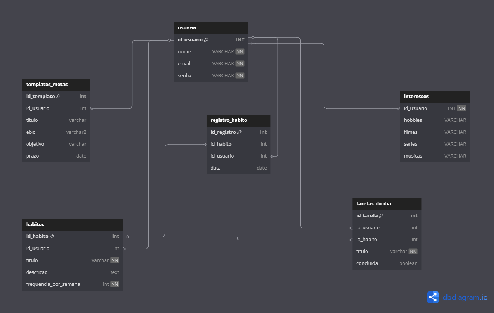

# Web Application Document - Projeto Individual - Módulo 2 - Inteli
## Nome do Projeto

#### Autor do projeto

## Sumário

1. [Introdução](#c1)  
2. [Visão Geral da Aplicação Web](#c2)  
3. [Projeto Técnico da Aplicação Web](#c3)  
4. [Desenvolvimento da Aplicação Web](#c4)  
5. [Referências](#c5)  

<br>

## <a name="c1"></a>1. Introdução (Semana 01)
O sistema desenvolvido é uma plataforma web chamada Habits, voltada para a organização pessoal de tarefas, hábitos e metas. Seu objetivo é ajudar os usuários a estruturarem suas rotinas de forma equilibrada, por meio de áreas temáticas como educação, saúde, vida financeira, entre outras, através de templates personalizáveis, permitindo que os usuários adaptem o sistema às suas necessidades.

Mais do que uma simples ferramenta de produtividade, o projeto também busca estimular o autoconhecimento e a autenticidade individual, oferecendo um espaço de perfil onde o usuário pode registrar seus hobbies, preferências culturais (como séries, livros e músicas).

O sistema será implementado utilizando a linguagem JavaScript com o framework Node.js e a biblioteca Express. A estrutura de pastas segue o padrão MVC (Model-View-Controller), promovendo a organização e a manutenção do código. A persistência dos dados será realizada por meio de um banco relacional.

A ideia é criar uma plataforma que não apenas auxilie na produtividade, mas que também incentive a reflexão pessoal e o desenvolvimento humano por meio de ferramentas integradas como o “diário de bordo” e a “pergunta diária”, funcionalidades previstas para futuras versões do projeto.

---

## <a name="c2"></a>2. Visão Geral da Aplicação Web

### 2.1. Personas (Semana 01 - opcional)
#### Persona 1

Person que foi construída para o desenvolvimento do projeto habits:
<div align="center">
<sup> Figura 1: Persona 01 </sup>
<br>
<sup>Fonte: Material produzido pelo autor (2025).</sup>
</div>

### 2.2. User Stories (Semana 01 - opcional)
<div align="center">
<sup> Quadro 1: User Storie US01 </sup>

Identificação | US01 (Prioritária)
--- | ---
Persona | Maria Alyce 
User Story | “Como estudante e Jovem Aprendiz, quero templates de organização para planejar minhas atividades diárias e poupar tempo”
Critério de aceite 1 | CR1: Alyce pode selecionar eixos da vida pessoal que deseja organizar e terá acesso a templates prontos.
Critério de aceite 2 | CR2: |Os templates devem ser personalizáveis para Alyce se planejar de acordo com sua necessidade. | 
Critérios INVEST | **Independente**: A funcionalidade não depende de outras features. Pode ser desenvolvida e entregue isoladamente. <br> **Negociável**: Os templates e a forma de personalização podem ser ajustados com base em feedbacks.<br> **Valorosa**:  Resolve a dor principal da persona (falta de tempo e organização fragmentada).<br> **Estimável**:  O escopo é claro (templates pré-prontos + personalização). <br> **Small**: Foca em uma necessidade específica (organização diária).<br> **Testável:** Pode ser avaliada com base nos critérios de aceite (Templates visualizáveis e personalizáveis).| <br>

<sup>Fonte: Material produzido pelo autor (2025).</sup>

---
<sup> Quadro 2: User Storie US02 </sup>

Identificação | US02
--- | ---
Persona | Maria Alyce |
User Story | “Como jovem esportista, quero manter hábitos pessoais e hobbies, para manter um equilíbrio entre obrigações e atividades que me trazem bem-estar.” |
Critério de aceite 1 | CR1: O usuário deve poder adicionar hábitos ou hobbies, com campos obrigatórios mínimos (nome, frequência e categoria).|
Critério de aceite 2 | CR2: O sistema deve permitir associar ícones ou cores aos hábitos/hobbies, facilitando a identificação rápida na dashboard.| <br>

<sup>Fonte: Material produzido pelo autor (2025).</sup>

---

<sup> Quadro 3: User Storie US03 </sup>

Identificação | US03
--- | ---
Persona | Maria Alyce |
User Story | “Como usuário, quero uma interface limpa e intuitiva, para encontrar rapidamente as funcionalidades que preciso." |
Critério de aceite 1 | CR1: O usuário deve acessar qualquer funcionalidade principal (hábitos, metas, agenda) em no máximo 2 cliques a partir da tela inicial.|
Critério de aceite 2 | CR2: O layout da tela inicial deve conter apenas atividades principais que serão realizadas no dia.|<br>

<sup>Fonte: Material produzido pelo autor (2025).</sup>
</div>

## <a name="c3"></a>3. Projeto da Aplicação Web

### 3.1. Modelagem do banco de dados  (Semana 3)

A modelagem relacional, é o processo inicial da construção de um banco de dados, no qual os dados são organizados em tabelas relacionadas entre si por meio de chaves primárias (PK) e chaves estrangeiras (FK). Abaixo encontra-se a modelagem relacional realizada para o banco de dados do projeto:

<div align="center">
<sup> Figura 2: Modelagem relacional do banco de dados </sup>
<br>
<sup>Fonte: Material produzido pelo autor (2025).<br>
Link para o material: https://dbdiagram.io/d/681c1c345b2fc4582fb07cf2 </sup>
</div>

| Tabela             | Descrição                                                                 |
|--------------------|---------------------------------------------------------------------------|
| `usuario`          | Armazena os dados principais do usuário: nome, e-mail e senha para login. |
| `interesses`       | Guarda os gostos pessoais do usuário, como hobbies, filmes e músicas.     |
| `habitos`          | Contém hábitos que o usuário quer acompanhar, com frequência semanal.     |
| `registro_habito`  | Registra a execução de um hábito em uma determinada data.                 |
| `tarefas_do_dia`   | Lista tarefas diárias do usuário, podendo estar ou não ligadas a hábitos. |
| `templates_metas`  | Modelos prontos para o usuário personalizar de acordo com suas metas; contendo título, eixo e prazo.    |

## Modelagem Física
A **modelagem física** do banco de dados é feita a partir do medlo relacional, o qual, para esse projeto foi transformado para a linguagem PostgreSQL. O modelo físico utilizado se encontra na pasta ``scripts``, no arquivo ``init.sql`` .

```javascript
/* cria a tabela de usuários */
CREATE TABLE "usuario" (
  "id_usuario" INT GENERATED BY DEFAULT AS IDENTITY PRIMARY KEY,
  "nome" VARCHAR NOT NULL,
  "email" VARCHAR NOT NULL,
  "senha" VARCHAR NOT NULL
);
/* tabela de interesses */
CREATE TABLE "interesses" (
  "id_usuario" INT NOT NULL,
  "hobbies" VARCHAR,
  "filmes" VARCHAR,
  "series" VARCHAR,
  "musicas" VARCHAR
);

/* tabela de habitos */
CREATE TABLE "habitos" (
  "id_habito" INT GENERATED BY DEFAULT AS IDENTITY PRIMARY KEY,
  "id_usuario" int,
  "titulo" varchar NOT NULL,
  "descricao" text,
  "frequencia_por_semana" int NOT NULL
);

/* tabela que registra o habito */
CREATE TABLE "registro_habito" (
  "id_registro" INT GENERATED BY DEFAULT AS IDENTITY PRIMARY KEY,
  "id_habito" int,
  "id_usuario" int,
  "data" date
);

/* tabela de tarefas do dia */
CREATE TABLE "tarefas_do_dia" (
  "id_tarefa" INT GENERATED BY DEFAULT AS IDENTITY PRIMARY KEY,
  "id_usuario" int,
  "id_habito" int,
  "titulo" varchar NOT NULL,
  "concluida" boolean
);

/* tabela de templates de metas */
CREATE TABLE "templates_metas" (
  "id_template" INT GENERATED BY DEFAULT AS IDENTITY PRIMARY KEY,
  "id_usuario" int,
  "titulo" varchar,
  "eixo" varchar2,
  "objetivo" varchar,
  "prazo" date
);

ALTER TABLE "interesses" ADD FOREIGN KEY ("id_usuario") REFERENCES "usuario" ("id_usuario");

ALTER TABLE "habitos" ADD FOREIGN KEY ("id_usuario") REFERENCES "usuario" ("id_usuario");

ALTER TABLE "registro_habito" ADD FOREIGN KEY ("id_habito") REFERENCES "habitos" ("id_habito");

ALTER TABLE "registro_habito" ADD FOREIGN KEY ("id_usuario") REFERENCES "usuario" ("id_usuario");

ALTER TABLE "tarefas_do_dia" ADD FOREIGN KEY ("id_usuario") REFERENCES "usuario" ("id_usuario");

ALTER TABLE "tarefas_do_dia" ADD FOREIGN KEY ("id_habito") REFERENCES "habitos" ("id_habito");

ALTER TABLE "templates_metas" ADD FOREIGN KEY ("id_usuario") REFERENCES "usuario" ("id_usuario");
```


### 3.1.1 BD e Models (Semana 5)
*Descreva aqui os Models implementados no sistema web*

### 3.2. Arquitetura (Semana 5)

*Posicione aqui o diagrama de arquitetura da sua solução de aplicação web. Atualize sempre que necessário.*

**Instruções para criação do diagrama de arquitetura**  
- **Model**: A camada que lida com a lógica de negócios e interage com o banco de dados.
- **View**: A camada responsável pela interface de usuário.
- **Controller**: A camada que recebe as requisições, processa as ações e atualiza o modelo e a visualização.
  
*Adicione as setas e explicações sobre como os dados fluem entre o Model, Controller e View.*

### 3.3. Wireframes (Semana 03 - opcional)

*Posicione aqui as imagens do wireframe construído para sua solução e, opcionalmente, o link para acesso (mantenha o link sempre público para visualização).*

### 3.4. Guia de estilos (Semana 05 - opcional)

*Descreva aqui orientações gerais para o leitor sobre como utilizar os componentes do guia de estilos de sua solução.*


### 3.5. Protótipo de alta fidelidade (Semana 05 - opcional)

*Posicione aqui algumas imagens demonstrativas de seu protótipo de alta fidelidade e o link para acesso ao protótipo completo (mantenha o link sempre público para visualização).*

### 3.6. WebAPI e endpoints (Semana 05)

*Utilize um link para outra página de documentação contendo a descrição completa de cada endpoint. Ou descreva aqui cada endpoint criado para seu sistema.*  

### 3.7 Interface e Navegação (Semana 07)

*Descreva e ilustre aqui o desenvolvimento do frontend do sistema web, explicando brevemente o que foi entregue em termos de código e sistema. Utilize prints de tela para ilustrar.*

---

## <a name="c4"></a>4. Desenvolvimento da Aplicação Web (Semana 8)

### 4.1 Demonstração do Sistema Web (Semana 8)

*VIDEO: Insira o link do vídeo demonstrativo nesta seção*
*Descreva e ilustre aqui o desenvolvimento do sistema web completo, explicando brevemente o que foi entregue em termos de código e sistema. Utilize prints de tela para ilustrar.*

### 4.2 Conclusões e Trabalhos Futuros (Semana 8)

*Indique pontos fortes e pontos a melhorar de maneira geral.*
*Relacione também quaisquer outras ideias que você tenha para melhorias futuras.*


## <a name="c5"></a>5. Referências

_Incluir as principais referências de seu projeto, para que o leitor possa consultar caso ele se interessar em aprofundar._<br>

---
---